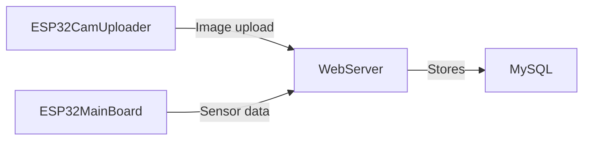

# CarProtect

CarProtect is a proof-of-concept IoT security system built during ECE140B.
It combines two ESP32 based microcontrollers with a small web application
that stores sensor data and displays live images.
The project consists of a Python web server backed by MySQL and two ESP32-based boards. One board hosts a camera module that uploads images while the other collects sensor data such as motion and vibration.


## System overview




## Repository layout

```
ESP32/              Firmware for the ESP32 boards
  ESP32CamUploader/        Sketch for the ESP32-CAM module
  ESP32MainBoard/ Sketch for the main ESP32 board

web/                Python web application and Docker config
  src/app/          Application package (routes, DB helpers)
  src/public/       Static files served by the web server
  src/templates/    Jinja2 templates
```

## Running the web server

The easiest way to run the server and database is via Docker:

```bash
docker-compose up --build
```

This starts a MySQL container and the Pyramid web application.
The application listens on port `80` on the host and connects to
MySQL using the credentials found in `credentials.env`.

To run the application locally without Docker, install dependencies
from `web/src/requirements.txt` and execute:

```bash
python -m app.server
```

(You must set the environment variables defined in `credentials.env`.)

`app.server` also respects two optional environment variables:

* `APP_HOST` - interface to bind (default `0.0.0.0`)
* `APP_PORT` - port number (default `6000`)

## Firmware

The `ESP32/ESP32CamUploader` sketch uploads images from the ESP32-CAM to the
server. `ESP32/ESP32MainBoard` reads sensor data (PIR, vibration and
accelerometer) and periodically sends it to the server.
Flash each sketch to the appropriate board using the Arduino IDE or
`arduino-cli`.

Before building, copy `config.h.example` from each sketch directory to
`config.h` and fill in your WiFi credentials and the hostname or IP
address of the web server.

After flashing, connect the ESP32-CAM's `5V` and `GND` pins to the
corresponding pins on the main ESP32 board and power the system.

## Demo

A short demonstration video can be found at
<https://youtu.be/MSkuZj5Wf60>.
